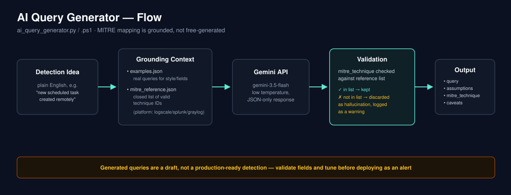

# What
A list of queries to detect and hunt for threats written mostly for Logscale/Graylog (the ones for Graylog could be used with Splunk/Lucene based systems, too).

# How
- For Splunk: just copy-paste it
- For Logscale: just copy-paste it
- For Graylog: I'm assuming you are using winlogbeat for shipping logs from Windows boxes here. Just copy-paste the queries in the search bar or use them to create custom alerts (for instance: "alert me when you see a domain admin change").

# AI Query Generator

Translates a plain-English detection idea into a draft Logscale / Splunk / Graylog query, using a few real queries from this repo as few-shot style/field reference. Available in two versions with identical behavior - `ai_query_generator.py` (Python) and `ai_query_generator.ps1` (PowerShell, no extra dependencies beyond what ships with PowerShell 5.1+/7+).

> Generated queries are a **starting point, not a production-ready detection**. Always validate field names against your actual log schema, test against historical data, and tune for false positives before deploying as an alert.



### Setup (Python)

```bash
pip install -r requirements.txt
cp .env.example .env   # then edit .env with your key, or export it directly
export GEMINI_API_KEY="..."
```

### Usage (Python)

```bash
python ai_query_generator.py \
  --platform logscale \
  --prompt "detect a new scheduled task created remotely" \
  --explain
```

### Setup & usage (PowerShell)

```powershell
$env:GEMINI_API_KEY = "..."

.\ai_query_generator.ps1 -Platform logscale -Prompt "detect a new scheduled task created remotely" -Explain
```

Add a handful of your own queries to `examples.json` (replacing the placeholders) so the model matches your real field names and conventions. Both versions read the same `examples.json` and `mitre_reference.json`, so you only maintain one copy of each.

### MITRE ATT&CK grounding

`mitre_reference.json` holds a small curated set of technique IDs relevant to this repo's detections. The model is instructed to pick `mitre_technique` only from this list (or return `null`) - any ID outside the list is treated as a hallucination, discarded, and logged as a warning rather than trusted. Extend the list as you add detections for new technique areas, and verify IDs against [attack.mitre.org](https://attack.mitre.org) before adding them (sub-technique numbering does get revised between ATT&CK versions).
