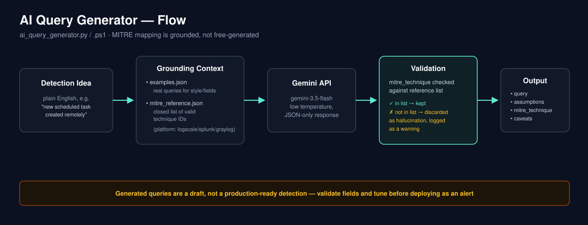

# What
A list of queries to detect and hunt for threats written mostly for Logscale/Graylog (the ones for Graylog could be used with Splunk/Lucene based systems, too).

# How
- For Splunk: just copy-paste it
- For Logscale: just copy-paste it
- For Graylog: I'm assuming you are using winlogbeat for shipping logs from Windows boxes here. Just copy-paste the queries in the search bar or use them to create custom alerts (for instance: "alert me when you see a domain admin change").

# AI Query Generator

Translates a plain-English detection idea into a draft Logscale / Splunk / Graylog query, using a few real queries from this repo as few-shot style/field reference. Available in two versions with identical behavior - `ai_query_generator.py` (Python) and `ai_query_generator.ps1` (PowerShell, no extra dependencies beyond what ships with PowerShell 5.1+/7+).

> Generated queries are a **starting point, not a production-ready detection**. Always validate field names against your actual log schema, test against historical data, and tune for false positives before deploying as an alert.



### Setup (Python)

```bash
pip install -r AI_assistant/requirements.txt
export GEMINI_API_KEY="..."
```

### Usage (Python)

```bash
python AI_assistant/ai_query_generator.py \
  --platform logscale \
  --prompt "detect a new scheduled task created remotely" \
  --explain
```

### Setup & usage (PowerShell)

```powershell
$env:GEMINI_API_KEY = "..."

.\AI_assistant\ai_query_generator.ps1 -Platform logscale -Prompt "detect a new scheduled task created remotely" -Explain
```

The API key is read from the `GEMINI_API_KEY` environment variable (or `-ApiKey` in PowerShell) and sent in the `x-goog-api-key` header, never in the URL. Both versions default to `gemini-3.5-flash`; override with `--model` / `-Model`.

`AI_assistant/examples.json` holds the few-shot examples, copied from the queries in `Logscale/` and `Graylog/` - keep it in sync when you edit those files, and add a handful of your own queries so the model matches your real field names and conventions. Both versions read the same `examples.json` and `mitre_reference.json` from their own folder (overridable with `--examples-file` / `--mitre-file`), so you only maintain one copy of each.

### MITRE ATT&CK grounding

`mitre_reference.json` holds a small curated set of technique IDs relevant to this repo's detections. The model is instructed to pick `mitre_technique` only from this list (or return `null`) - any ID outside the list is treated as a hallucination, discarded, and logged as a warning rather than trusted. Extend the list as you add detections for new technique areas, and verify IDs against [attack.mitre.org](https://attack.mitre.org) before adding them (sub-technique numbering does get revised between ATT&CK versions).
